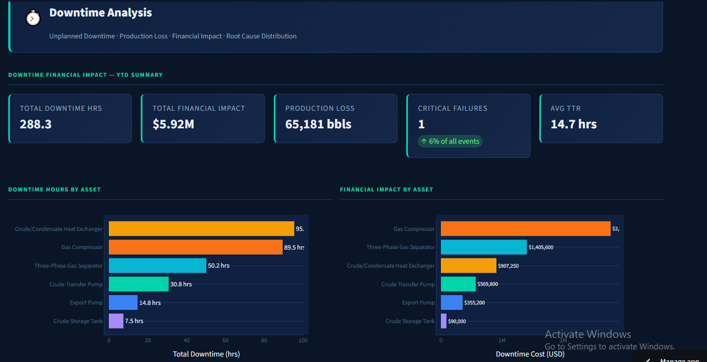

# ORPMI Platform

## Operational Reliability & Predictive Maintenance Intelligence

**Predicts equipment failure 30 days ahead — ISO 14224 aligned, deployed on Docker and Streamlit Cloud.**

🔗 **[Live Demo: orpmi-platform-ninahenchy.streamlit.app](https://orpmi-platform-ninahenchy.streamlit.app/)**


[](https://sqlite.org)


Production-grade industrial analytics platform for Oil & Gas production facility operations, aligned to ISO 14224 reliability data standards.

---

## Model Performance

| Metric | Value | Notes |
|---|---|---|
| ROC-AUC | **0.9381** | Temporally validated — train Jan–Sep, test Oct–Dec |
| Recall | 0.294 | Threshold set at 0.4 — optimised for PdM cost structure |
| F1 Score | 0.454 | Balanced against false alarm rate |
| Features | **80 engineered** | Vibration, temperature, pressure, efficiency, maintenance history |
| Validation | **Temporal split** | No data leakage — mirrors production deployment reality |
| Tests | **76 / 76 passing** | Full automated test suite |

> **Why Recall 0.294?** In predictive maintenance, the cost of a missed failure (unplanned downtime) far exceeds the cost of a false alarm (unnecessary inspection). The decision threshold is set at 0.4 — a business decision, not a statistical one.

---

## Dashboard Preview



---

## Platform Overview

The ORPMI Platform transforms fragmented operational data into decision-ready intelligence across four capability layers:

| Layer | Capability | Audience |
|---|---|---|
| **Data Foundation** | ISO 14224 asset database, ETL pipeline, 29-check validation | Data Engineer |
| **Reliability Analytics** | MTBF, MTTR, availability, downtime cost, maintenance compliance | Reliability Engineer |
| **Predictive Intelligence** | ML failure probability (ROC-AUC 0.9381), risk scoring, maintenance recommendations | Maintenance Superintendent |
| **Executive Reporting** | Fleet KPIs, AI narratives, financial impact, operational risk register | Operations Director |

---

## Architecture

```
Data Entry (Streamlit Forms)
        │
        ▼
  SQLite Database
  (ISO 14224 schema · 7 tables · 29-point validation · 4,700+ records)
        │
        ▼
   ETL Pipeline
   (automated transforms · data quality checks · incremental loading)
        │
        ▼
 Feature Engineering
 (80 features · rolling stats 7/14/30d · MTBF trajectory · vibration slope · degradation rate)
        │
        ▼
  Random Forest Model
  (class_weight=balanced · threshold=0.4 · temporally validated)
        │
        ▼
  10-Page Streamlit Dashboard
  (asset health · failure probability · maintenance recommendations · KPIs · data entry)
```

---

## Platform Pages

| Page | Content |
|---|---|
| Executive Overview | Fleet-level KPIs — OEE, MTBF, MTTR, availability, downtime cost |
| Asset Health Monitor | Real-time health scores and risk classification per asset |
| Predictive Maintenance | 30-day failure probability gauges and trend charts |
| Failure Analysis | Historical failure patterns by asset type and failure mode |
| Maintenance Intelligence | Work order analytics and PM effectiveness tracking |
| Reliability KPIs | MTBF, MTTR, OEE trends over time by asset and department |
| Cost Analytics | Downtime cost tracking and maintenance cost breakdown |
| Work Order Management | Open, in-progress, and completed work order pipeline |
| ISO 14224 Explorer | Equipment taxonomy browser aligned to standard |
| Data Entry | Live operational data input — writes directly to database |

---

## Standards Alignment

| Standard | Application |
|---|---|
| **ISO 14224** | Equipment taxonomy, failure mode classification, 7-table relational data model |
| **ISO 10816** | Vibration severity zone classification (A/B/C/D) embedded in feature engineering |
| **ISO 45001** | HSE management system context — see also HSEI and HSIP platforms |

---

## Assets Monitored

6 critical asset types across the OPC-Alpha simulated offshore facility:

**Pumps · Compressors · Heat Exchangers · Tanks · Vessels · Separators**

---

## Tech Stack

```
Python 3.11    Scikit-Learn    Pandas    NumPy
SQLite         SQLAlchemy      Plotly    Streamlit
Docker         Git             pytest
```

---

## Run Locally

```bash
# Clone the repository
git clone https://github.com/NinaHenchy/orpmi-platform
cd orpmi-platform

# Run with Docker (recommended)
docker-compose up --build
# Open http://localhost:8502

# Or run directly
pip install -r requirements.txt
streamlit run dashboards/app.py
```

The platform initialises its own database and runs ETL automatically on first launch. No manual setup required.

---

## Project Structure

```
orpmi-platform/
├── dashboards/
│   ├── app.py                    # Main Streamlit application
│   ├── components/               # Reusable UI components and theme
│   └── pages/                    # Individual dashboard pages (p1–p10)
├── database/
│   ├── schemas/                  # ISO 14224-aligned SQL schema
│   └── db_connection.py          # Database connection management
├── etl/
│   ├── extractors/               # Synthetic data generation
│   └── loaders/                  # Database loading pipeline
├── models/
│   ├── predictor.py              # Random Forest training and inference
│   └── artifacts/                # Serialised model files (.pkl)
├── tests/                        # 76 automated tests
├── scripts/                      # Setup and training scripts
├── requirements.txt
└── docker-compose.yml
```

---

## Live Demo

🔗 **[orpmi-platform-ninahenchy.streamlit.app](https://orpmi-platform-ninahenchy.streamlit.app/)**

The platform initialises its database and runs ETL automatically on first load. Allow up to 60 seconds on first visit for the database to populate.

---

## Related Platforms — OPC-Alpha Analytics Suite

All three platforms run on the same simulated offshore production facility (OPC-Alpha) and share a consistent data architecture.

| Platform | Focus | Standards | Tests | Live Demo |
|---|---|---|---|---|
| **[HSEI](https://github.com/NinaHenchy/hsei-platform)** | HSE Incident Analytics & Process Safety Intelligence | API RP 754 · ISO 45001 · NUPRC · NOSDRA | 29 ✅ | [Launch](https://hsei-platform-ninahenchy.streamlit.app/) |
| **[HSIP](https://github.com/NinaHenchy/hsip-platform)** | Safety Culture & LTI Prediction | ISO 45001 · Safety Culture Index (SCI) | 19 ✅ | [Launch](https://hsip-platform-ninahenchy.streamlit.app/) |

---

## Author

**Nnenna Henchard** — Reliability Data Scientist · 15 years O&G Operations & HSE

[](https://linkedin.com/in/nnenna-henchard)
[](https://ninahenchy.github.io)
[](mailto:ninahenchard@gmail.com)
